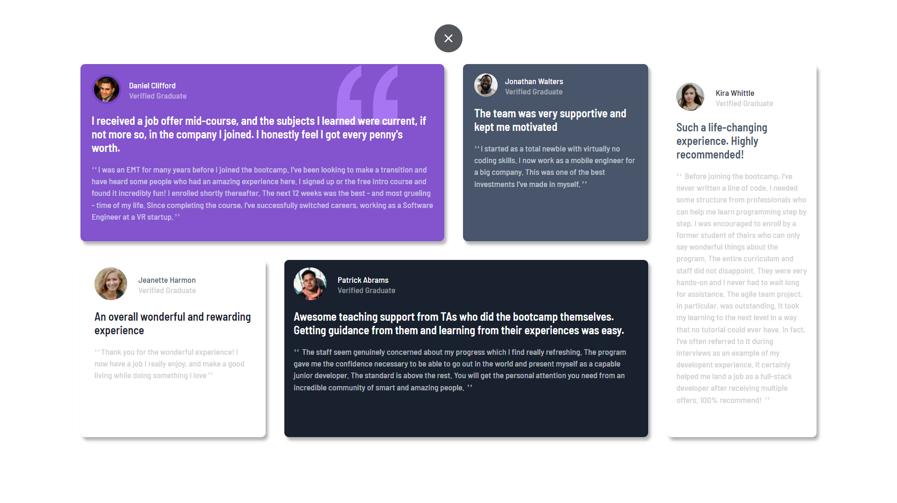
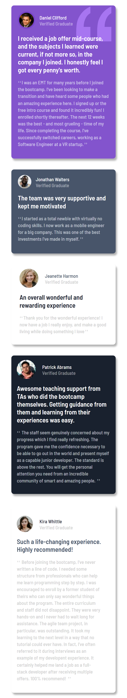

# Testimonials-Grid-Section

# Frontend Mentor - Testimonials grid section solution

This is a solution to the [Testimonials grid section challenge on Frontend Mentor](https://www.frontendmentor.io/challenges/testimonials-grid-section-Nnw6J7Un7). Frontend Mentor challenges help you improve your coding skills by building realistic projects. 

## Table of contents

- [Overview](#overview)
  - [The challenge](#the-challenge)
  - [Screenshot](#screenshot)
  - [Links](#links)
- [My process](#my-process)
  - [Built with](#built-with)
  - [What I learned](#what-i-learned)
  - [Continued development](#continued-development)
  - [Useful resources](#useful-resources)
- [Author](#author)
- [Acknowledgments](#acknowledgments)

## Overview

### The challenge

Users should be able to:

- View the optimal layout for the site depending on their device's screen size

### Screenshot




### Links

- Solution URL: [(https://github.com/AmanGupta1703/Testimonials-Grid-Sectionn)]
- Live Site URL: [https://amangupta1703.github.io/Testimonials-Grid-Section/)]

## My process

### Built with

- Semantic HTML5 markup
- CSS custom properties
- CSS Grid

### What I learned

```css
/* BOX-1 */
.box-1::before {
    content: url("../images/bg-pattern-quotation.svg");
    position: absolute;
    z-index: 1;
    top: .1rem;
    right: 5rem;
}

.box-1 {
    box-shadow: 4px 6px 5px rgba(0, 0, 0, .3);
    background: var(--moderate-violet);    
    border-radius: 8px;
    padding: 1.1rem 1.2rem 1rem;
    grid-column: 1 / 16;
    grid-row: 1 / 2;
    position: relative;
}

/* USER-INFO */
.user-info {
    display: inline-flex;
    align-items: center;
    margin: 0 0 .8rem;
}

.avatar {
    border: 4px solid var(--br-primary);  
    border-radius: 50%;
    width: 80%;
}

.username {
    color: var(--white);
    font-size: .9rem;
}

.verification {
    color: var(--verification-clr);
    font-size: .9rem;
}

/* TEXT-CONTENT */
.text {
    color: var(--white);
    font-size: 1.2rem;
    position: relative;
    z-index: 2;
}

.review {
    color: hsl(210, 46%, 95%, 70%); 
    font-size: .9rem;
    margin: 1rem 0; 
    line-height: 1.4; 
}

.review::before {
    content: "ߵߵ";
    padding: 0 .1rem 0 0;
}

.review::after {
    content: "ߴߴ";
    padding: 0 0 0 .1rem;
}

/* BOX-2 */
.box-2 {
    box-shadow: 4px 6px 5px rgba(0, 0, 0, .3);
    background-color: var(--dark-grayish-blue);
    border-radius: 8px;
    grid-column: 16 / 24;
    grid-row: 1;
    padding: 1rem 1.2rem;
}

/* USER INFO */
.user-2 {
    gap: .8rem;
}

.avatar-jonathan {
    border: none;
    border-radius: 50%;
    width: 2.5rem;
}

/* Box-3 */
.box-3 {
    box-shadow: 4px 6px 5px rgba(0, 0, 0, .3);
    border-radius: 8px;
    grid-column: 1 / 9;
    grid-row: 2 / 3;
    padding: .8rem 1.5rem;
}

.user-3 {
    gap: 1.2rem;
}

/* AVATAR */
.avatar-jeanette {
    border-radius: 50%;
}

.clr-dark-grayish-blue {
    color: var(--dark-grayish-blue);
}

.clr-dark-blackish-blue {
    color: var(--dark-blackish-blue);
}

.clr-light-gray {
    color: var(--light-gray);
}

/* TEXT-CONTENT */
.jeanette-review {
    font-size: .9rem;
}

/* BOX-4 */
.box-4 {
    box-shadow: 4px 6px 5px rgba(0, 0, 0, .3);
    background-color: var(--dark-blackish-blue);
    border-radius: 8px;
    grid-column: 9 / 24;
    grid-row: 2 / 3;
    padding: .8rem 1rem;
}

/* BANNER */
.avatar-patrick {
    border-radius: 50%;
}

.patrick-review {
    font-size: .9rem;
}

/* BOX-5 */
.box-5 {
    box-shadow: 4px 6px 5px rgba(0, 0, 0, .3); 
    border-radius: 8px;
    grid-column: 24 / 29;
    grid-row: 1 / 3;
    padding: 2rem 1rem 1rem 1rem;
    width: 16rem;
}

/* AVATAR */
.avatar-kira {
    border-radius: 50%;
    width: 3rem;
}

/* Text-Content */
.kira-review {
    width: 14rem;
}
```

### Continued development
1) Grid Layout
2) Responsive Design

### Useful resources

- [W3School => Grid](https://www.w3schools.com/css/css_grid.asp)

## Author

- Website - [Testimonials Grid Section](https://amangupta1703.github.io/Testimonials-Grid-Section/)
- Frontend Mentor - [@AmanGupta1703](https://www.frontendmentor.io/profile/AmanGupta1703)
